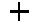

<!-- SPDX-License-Identifier: CC-BY-4.0 -->
<!-- Copyright Contributors to the ODPi Egeria project 2020. -->

The **Glossary Author** is an allows you to author glossary content, such as Glossary , Term, Categories
and the relationships between them.

# Concepts

Egeria has subject area open types that are described in [Area 3](https://egeria.odpi.org/open-metadata-publication/website/open-metadata-types/Area-3-models.html). This mature model of glossary content shows you the relevant concepts around glossaries.

The Glossary Author exposes concepts (json objects) that map onto the open types. The Glossary Author concepts are intended to make it easier for a 
user interface to author glossaries. 

As metadata is often best thought of as a graph; the Glossary author user interface exposes the concept of a Graph contining only the concepts relevantg to a 
glossary author. The Graph is composed of Nodes (vertices) and Lines (edges).  

The Node is the top level parent object for Glossary, Category and Term, which in turn have child objects; these all map back to the Area 3 concepts. The Node object contains standard Egeria properties including:

* Name - name to be displayed.
* qualfied name - readable unique name
* guid - global unqiue identifier, unique identifier.
* Effective startyand end times - to indicate when the node is effective.    

   

# Working with the Glossary Author user interface.

Note the screenshots might be slightly out of date with the code base. 

## Getting to the Glossary Author start screen
- After logging into the Egeria react UI, you will see tasks at the left hand side of the user interface including the glossary author task.
  
- If you see a screen with a connect button like this  then the glossary author is not able to issue a successfully glossary call; this is caused by either
   - the Subject Area OMAS is not active, so the glossary author cannot call it
   - the glossary author view is not configured on the view server.
   - the presentation server is not configured to point to the glossary server view service.   
   If everythign is correctly configured but the view server or its downstream server is not started then, start them and press the connect button.  
- Assuming you have successfully connected, then you are now in a position to author glossary content and should see
  
- You will notice that you can choose the node to work with using the node tabs

## Add a glossary
- Add a node on a tab using the  add button. Pressing add for glossary will show
 . The minimal input is a name.
pressing create will show a screen like : 
 

 ## Working with a glossary
- Navigating back after having created a glossary called 'glossary1' in an empty system will show you 
 
- 'List view' You can toggle the glossary view to show the glossaries as a list

- 'paging' - notice the paging options, these allow you to change the page size (how many are displayed), page through the results if there is more than a page's worth to display.
- 'filter' Entering text into the filter box  filters the displayed results. If you want an exact match, check ]     

## Button that appear when a node is selected 
- Note that there is a checkbox on the node card; when checked, buttons appear indicating actions you can perform against the selected node:
  -  - this is shown for glossary, to quickly create Terms under the selected glossary
  -  - this shows the children of the selected node.
  -  - this displays an edit screen for the selected node
  -  - this deletes the selected node. Glossaries with content cannot be deleted.

## Quick terms
- The quick term screen looks like this:
  
- Press the + button to add extra rows
  
- fillin the name and description in the rows
  
- press Create Terms on Server button to show
  

## Working with Categories and Terms
Working with Categories and terms, is similar to working with Glossaries, apart from
  - choosing the Term or Category node tab, Terms or Categories can be created, in this case a wizard is displayed to aske the user to choose the glossary in which the term should be created. Here is the first page of the term wizard
    

## Glossary children
When chosing the glossary children, the categories and terms under that glossary are displayed. 
  
By default top categories are displayed, these are categories that do not have a parent category. If you want to see the all the categories under the glossary then toggle the Top Categories  to All Categories .

## Future improvements
- a breadcrumb will be added to show visually where in a nested hierarchy the nodes being displayed live.
- Allow category hierarchies to be authored. i.e. child categories of categories
- Allow lines to be authored
- Use a D3 visualisation of glossary content similar to rex
- add governance classification authoring
- add spine object views
- add collaboration authoring and viewing
- start with a context from the community profile.   

----
License: [CC BY 4.0](https://creativecommons.org/licenses/by/4.0/),
Copyright Contributors to the ODPi Egeria project.
